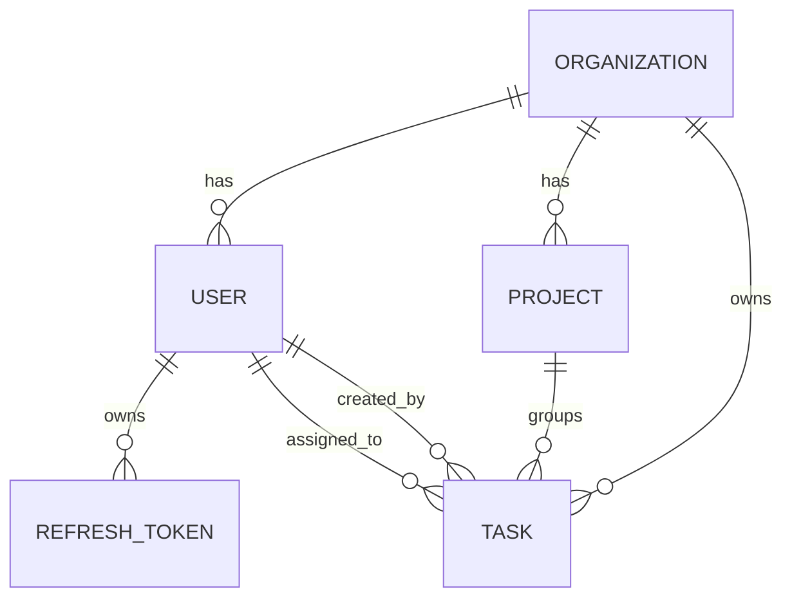

# TeamTask Tracker

A multi-tenant task tracking application featuring role-based access control (RBAC), database indexing optimizations, Redis list caching, and token-rotating JWT authentication. 

The project is configured as a monorepo containing a Node.js + Express backend and a React + Vite frontend, containerized with Docker Compose.

---

## Quick Start: Docker Compose

The application stack is managed using Docker Compose, which configures the database, caching layer, API backend, and hot-reloading frontend.

### Prerequisites
- [Docker](https://docs.docker.com/get-docker/)
- [Docker Compose](https://docs.docker.com/compose/install/)

### Start the Services
Run the following command in the project root:
```bash
docker compose up --build
```

This command provisions the following services:
1. **PostgreSQL** (`postgres`): The relational database. Migrations and seed data are applied automatically on startup.
2. **Redis** (`redis`): The cache store.
3. **Backend API** (`backend`): Express server listening on `http://localhost:5002`.
4. **React Frontend** (`frontend`): Vite application running on `http://localhost:3000`.

### Test Accounts
The database seeding script configures one test organization ("Acme Corp") and the following users:

| Role | Email | Password | Allowed Capabilities |
| :--- | :--- | :--- | :--- |
| **ADMIN** | `admin@acme.com` | `AdminPass123!` | Full organization management (users, projects, tasks). |
| **MANAGER** | `manager@acme.com` | `ManagerPass123!` | Project and task CRUD, assign members. Cannot manage users. |
| **MEMBER 1** | `member1@acme.com` | `MemberPass123!` | View and update status of tasks assigned directly to them. |
| **MEMBER 2** | `member2@acme.com` | `MemberPass123!` | View and update status of tasks assigned directly to them. |

---

## Database Architecture & Design

### Schema Overview

The database relationships are structured around strict multi-tenant isolation keyed by `organizationId`:



1. **Organization (`organizations`)**: Primary boundary for tenant isolation.
2. **User (`users`)**: Accounts scoped to an organization with a designated role (`ADMIN`, `MANAGER`, or `MEMBER`).
3. **Project (`projects`)**: Category groupings for tasks.
4. **Task (`tasks`)**: Work units containing metadata, priority (`LOW`, `MEDIUM`, `HIGH`), status (`TODO`, `IN_PROGRESS`, `IN_REVIEW`, `DONE`, `BLOCKED`), `dueDate`, and relational keys.
5. **RefreshToken (`refresh_tokens`)**: Tracks rotating user sessions.

### Indexing Decisions
To ensure consistent query response times as data sizes scale, the following database indexes are defined in `schema.prisma`:
- **`Task(status)`**: Optimizes status filtering and groupings on the Kanban Board.
- **`Task(assigneeId)`**: Speeds up retrieval of dashboard lists for specific assignees.
- **`Task(dueDate)`**: Optimizes queries evaluating overdue task thresholds.
- **`Task(organizationId)`**: Enforces tenant-isolation performance, ensuring multitenant filters do not result in full table scans.

---

## Authentication & Refresh Token Rotation (RTR)

The API enforces Refresh Token Rotation (RTR) to protect user sessions:
- Authenticated clients receive a short-lived `accessToken` (15 minutes, stored in-memory) and a long-lived `refreshToken` (7 days, stored in `localStorage`).
- Exchanging a refresh token for a new access token triggers token rotation:
  1. The API validates the submitted refresh token.
  2. The submitted token is revoked (`isRevoked: true`).
  3. A new access token and a new refresh token are generated, saved, and returned.
- **Token Theft Defense**: If a client submits a refresh token that has already been marked as revoked (indicating a potential interception/replay attack), the API revokes all active refresh tokens associated with that user. This forces all active sessions to log out immediately.

---

## Redis Caching & Invalidation Strategy

### Caching Flow
To minimize database reads, task lists for individual assignees are cached under `tasks:assignee:<assigneeId>` keys:
- The controller checks the cache for base task queries (e.g., retrieving lists for a single assignee without filtering parameters).
- **Cache Hit**: Returns the parsed JSON payload directly from Redis.
- **Cache Miss**: Queries the PostgreSQL database, saves the result to Redis with a **1-hour TTL**, and returns the response.

### Invalidation Triggers
The cache is invalidated during database write operations to prevent stale client states:
1. **Creation**: Invalidates the cache for the task assignee.
2. **Deletion**: Invalidates the cache for the task assignee.
3. **Update**: Invalidates the cache for the task assignee.
4. **Re-assignment**: If a task's assignee changes, the caches for both the previous and newly assigned users are cleared.

---

## Role-Based Access Control (RBAC)

Access controls are managed via centralized middleware rather than inline controller checks:
- `requireRoles(roles)`: Rejects requests if the parsed JWT user role is not within the specified array (e.g., restricting task creation to `ADMIN` and `MANAGER`).
- `authorizeTaskAccess`: Verifies that:
  1. The requested task belongs to the user's organization.
  2. If the user is a `MEMBER`, the task's `assigneeId` matches the user's `id`.
- **Field Gating**: If a `MEMBER` attempts to update task attributes other than `status` (such as `title`, `priority`, or `dueDate`), the request is rejected with a `403 Forbidden` response.

---

## Integration Testing

An integration test suite using **Jest** and **Supertest** validates auth and permission boundaries.

### Running the Tests
Execute the tests inside the backend container container:
```bash
docker compose exec backend npm run test
```

The test cases cover:
1. **Authentication RTR**: Token rotation, database revocation, and session invalidation on token reuse detection.
2. **RBAC Rules**: Verification that `MEMBER` accounts are restricted from task creation, project creation, and illegal task status transitions (e.g. attempting to jump from `TODO` straight to `DONE`).

---

## Future Enhancements Roadmap

1. **Real-time Updates**: Implement WebSockets or Server-Sent Events (SSE) to sync board states across clients instantly.
2. **E2E Testing**: Add Cypress or Playwright test suites to validate drag-and-drop feedback loops and visual layouts.
3. **Audit Logging**: Add a `TaskActivity` ledger to track transition history and editor identities.
4. **Soft Deletes**: Implement flag-based deletions to maintain historic analytics integrity.
