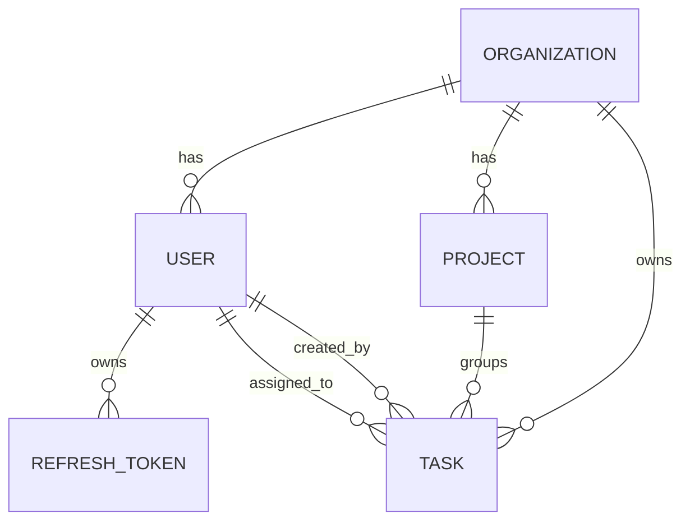

# TeamTask Tracker System

A robust, enterprise-grade team task tracking platform. The system is designed to provide secure team space collaboration under strict Role-Based Access Control (RBAC), multi-level tenant isolation, performance optimizations using relational PostgreSQL indexes and Redis list-caching, and token-theft protected JWT Authentication.

This project delivers both a **TypeScript + Express REST API** and a **Vite + React Single Page Application** styled with a premium dark-mode glassmorphic Tailwind CSS design.

---

## ⚡ Quick Start: Docker Compose

The entire network is orchestrated using Docker Compose. The reviewer can spin up the relational database, cache store, API backend, and React hot-reloaded frontend in a single step with no manual configuration.

### Prerequisites
Make sure you have [Docker](https://docs.docker.com/get-docker/) and [Docker Compose](https://docs.docker.com/compose/install/) installed.

### Start the Services
Run the following command in the root directory of the project:
```bash
docker compose up --build
```

This single command will:
1. Boot a **PostgreSQL** database service (`postgres`) and execute health checks.
2. Boot a **Redis** caching service (`redis`) and verify status.
3. Build and launch the **Backend API** on `http://localhost:5002`.
   - On boot, the backend automatically applies database migrations and runs a seeding script to populate testing accounts and initial boards.
4. Build and launch the **React Frontend** on `http://localhost:3000`.

### 👥 Test Accounts (Seeded Out-of-the-Box)
To inspect role restrictions and board features immediately, log in with the following seeded accounts:

| Role | Email | Password | Allowed Capabilities |
| :--- | :--- | :--- | :--- |
| **ADMIN** | `admin@acme.com` | `AdminPass123!` | Full control. Manage users, projects, tasks. |
| **MANAGER** | `manager@acme.com` | `ManagerPass123!` | Create/edit tasks, assign members, create projects. Cannot manage users. |
| **MEMBER 1** | `member1@acme.com` | `MemberPass123!` | View and update only their assigned tasks. |
| **MEMBER 2** | `member2@acme.com` | `MemberPass123!` | View and update only their assigned tasks. |

---

## 🏗️ Architecture & Database Design

### Schema Overview
The database uses a clean, relational structure built in PostgreSQL. Below is the written description of the entities and their relationships:



1. **Organization (`organizations`)**: The primary multitenant boundary. All users, projects, and tasks strictly belong to an organization.
2. **User (`users`)**: Represents team members. Has an access role (`ADMIN`, `MANAGER`, or `MEMBER`) and links to their organization.
3. **Project (`projects`)**: Scopes tasks into distinct functional categories or initiatives.
4. **Task (`tasks`)**: Represents tracked units of work, containing `title` (required), `description`, `priority` (`LOW`, `MEDIUM`, `HIGH`), `status` (`TODO`, `IN_PROGRESS`, `IN_REVIEW`, `DONE`, `BLOCKED`), `dueDate`, `assigneeId`, and `projectId`.
5. **RefreshToken (`refresh_tokens`)**: Secures user sessions, tracking rotating refresh token records and revocation statuses.

### 📈 Database Indexing Decisions
To guarantee rapid response times under high throughput, we have added target indexes in our Prisma schema:

1. **Single-Field Index on `Task(status)`**: Essential for dashboards like the Kanban Board which filter and group tasks by their workflow status. Without this index, PostgreSQL would execute a slow table scan as task numbers grow.
2. **Single-Field Index on `Task(assigneeId)`**: Essential for role-based queries. The most common query in the platform is a Member listing their assigned tasks. This index ensures rapid record retrieval.
3. **Single-Field Index on `Task(dueDate)`**: Speeds up the analytics queries calculating overdue task boundaries (`dueDate < NOW()`).
4. **Single-Field Index on `Task(organizationId)`**: Protects multitenancy boundaries. Every query in the API is restricted by the user's `organizationId`. Keeping this field indexed ensures that queries are quickly isolated to their correct tenant group.

---

## 🔒 JWT Authentication & Refresh Token Rotation (RTR)

We implement state-of-the-art **Refresh Token Rotation (RTR)** to secure API endpoints:
- On login, users receive a short-lived `accessToken` (15m) and a long-lived `refreshToken` (7d).
- Access tokens are stored in-memory in the React app, and the refresh token is stored in `localStorage` for session restoration.
- Whenever a client requests a new access token using a refresh token (either on page reload or when the access token is close to expiry), the backend executes a rotation:
  1. It validates the refresh token.
  2. It revokes the old refresh token in the database (`isRevoked: true`).
  3. It generates and saves a completely new access token and new refresh token, returning them to the client.
- **Token Theft Protection**: If the backend detects a refresh token that has **already** been marked as revoked (indicating that a malicious actor has intercepted the token and attempted to reuse it), the system **triggers a full security breach protocol**. It automatically revokes **ALL active refresh tokens associated with that user**, forcing all active sessions to log out immediately and requiring the user to re-authenticate.

---

## 🚀 Redis Caching & Invalidation Strategy

### Caching Strategy
We cache the complete task lists of individual assignees in Redis under the key `tasks:assignee:<assigneeId>`.
- When a user (especially a `MEMBER`) logs in and requests their task board, the system intercepts the database query and reads directly from Redis.
- If it is a cache hit, the task list is returned in **sub-millisecond speed** directly from RAM, reducing database CPU load.
- If it is a cache miss, the data is fetched from PostgreSQL, written to Redis with a **1-hour Time-to-Live (TTL)**, and then returned.

### Cache Invalidation Strategy
To ensure that users never see stale board information, we implement a targeted, transactional cache invalidation strategy in our controller actions:
1. **On Task Creation**: If an assignee is designated, we instantly clear the cache for that assignee: `redisClient.del("tasks:assignee:<assigneeId>")`.
2. **On Task Deletion**: We instantly clear the cache of the deleted task's assignee.
3. **On Task Update (Status or Details change)**: We instantly clear the assignee's cache.
4. **On Task Reassignment (Assignee change)**: This is a crucial edge case. If a task is reassigned from `User A` to `User B`, the cache for **both User A (the old assignee) and User B (the new assignee)** is invalidated. This guarantees that User A's board instantly reflects the removal and User B's board instantly reflects the addition.

---

## 🛡️ Role-Based Access Control (RBAC) Middleware

RBAC is strictly enforced at the **routing and middleware layer** of the API, rather than cluttering core controllers:
- `requireRoles(roles)`: Intercepts endpoint requests and validates that the decoded JWT user role is within the permitted array. For example, creating tasks is restricted to `[ADMIN, MANAGER]`.
- `authorizeTaskAccess`: A custom object-level access control middleware that runs on individual task requests (e.g. `/api/tasks/:id`):
  1. It queries the task.
  2. It verifies that the task belongs to the user's organization (tenant isolation).
  3. If the user is a `MEMBER`, it verifies that the task's `assigneeId` matches the user's `id`. If not, it throws a `403 Forbidden` error.
- **Field-Level Gating**: During updates, the controller evaluates the user's role. If a `MEMBER` attempts to update fields other than `status` (such as `title` or `dueDate`), the request is rejected. Furthermore, the status transition validation verifies that "Only the assignee or a MANAGER/ADMIN can advance a task's status".

---

## 🧪 Automated Testing

We have built a comprehensive integration test suite using **Jest** and **Supertest** to test critical flows.

### Running Tests
To run the automated tests inside the backend workspace, open a new shell and execute:
```bash
docker compose exec backend npm run test
```

This will run the integration tests which verify:
1. **Authentication RTR**: Token issuance, rotation, and revocation. It verifies that reusing a revoked refresh token successfully revokes all tokens for that user.
2. **RBAC Gating**: Verifies that members are blocked from creating tasks, and that task status transitions strictly follow the state-machine paths (e.g., `TODO -> IN_PROGRESS` succeeds, `TODO -> DONE` is blocked).

---

## 🔮 Roadmap: Future Enhancements

Given more time, we would implement the following high-priority features:
1. **Real-time Synchronization (SSE/WebSockets)**: Establish an event-driven network. Whenever a MANAGER changes a task status or assignee, a notification is sent instantly to the assignee's screen.
2. **Comprehensive Frontend Unit & Component Tests**: Add Cypress/Playwright E2E tests and React Testing Library suites to verify drag-and-drop feedback and role-based board views.
3. **Advanced Activity Logs**: Introduce a `TaskActivity` model tracking a chronological history of edits (e.g., "Bob changed status from IN_PROGRESS to IN_REVIEW on May 29").
4. **Soft Deletes**: Implement soft deletes on tasks and users to preserve analytics histories and prevent data loss.
